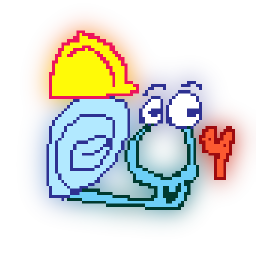

# Will You Mod Your Snail
A Will You Snail mod manager for **Windows**.

<!-- the wall of badges -->


[](https://crowdin.com/project/will-you-mod-your-snail)


## Important
Will You Mod Your Snail **is not complete**. There are parts of it that need to be finished, and to add on to that, the setup process is broken. But, it's general purpose of installing mods and starting the game is *useable*. If you truely want to run Will You Mod Your Snail *right now*, follow the instructions on compiling the app, and then follow the instructions on manually setting it up.

## Features
### Easily manage your mods for Will You Snail


### Control GMML settings with ease


<!-- add more when its more complete lol -->

## Building
Building is simple, thanks to Electron Forge.

After cloning the repo, install dependencies...
```
npm i
```

...and run the following command.
```
npm run make
```

That's it! If you're a power user, here's some one liners that you can paste into your shell to clone, install, build, and open the output folder in one go.
```
Command Prompt: git clone https://git.the0show.com/WillYouModYourSnail.git && cd WillYouModYourSnail && npm i && npm run make && explorer out
Powershell: git clone https://git.the0show.com/WillYouModYourSnail.git; cd WillYouModYourSnail; npm i; npm run make; explorer out
WSL: git clone https://git.the0show.com/WillYouModYourSnail.git && cd WillYouModYourSnail && npm i && npm run make && explorer.exe out
```

## Manual Setup
If you really want to use it now, here's how to set it up.

First, and this is important, **install GMML into your Will You Snail game directory**! The setup process is completely broken, so it won't do it for you!

[Click here for a link to the latest version.](https://github.com/cgytrus/gmml/suites/6701126385/artifacts/254714050) Just open the zip and copy it's contents into your Will You Snail game directory (where `Will You Snail.exe` is inside of).

Now, launch the application. You should see this:


Unfortunately as previously stated, the setup process doesn't work. At all. So, we're going to have to go in manual mode.

Press <kbd>Ctrl</kbd> + <kbd>Shift</kbd> + <kbd>I</kbd> or <kbd>F12</kbd> to open DevTools. Then, go to `Application` > `Local Storage` > `file://`. You should see this:


As you can see, it's already filled out the default setting values for most of the config. All we need to do is specify the game directory.

Copy the path to your Will You Snail game directory (again, the one where `Will You Snail.exe` is inside of), and set it as the value of `gameDir`. It should look something like this:


Now, we're all setup! The last thing we have to do is exit this screen. There's two ways to do it:
### Restart the app (the "i'm too lazy to deal with the console today" method)
Press <kbd>Ctrl</kbd> + <kbd>R</kbd>. This will restart the app instantly.
> **Quick Tip**
> 
> This is one of the many shortcuts I've added into the app. Here's the rest of them:<br />
> - <kbd>Ctrl</kbd> + <kbd>Shift</kbd> + <kbd>R</kbd> | Reloads the current page. Useful for testing changes to the page or it's preload scripts.
> - <kbd>F8</kbd> | Opens the issue reporter in your default browser.
> - <kbd>Shift</kbd> + <kbd>F8</kbd> | Opens your file browser, and highlights the current log file.

If all goes well, you should be brought to the `Mods` page.

### Switch to the page via console (the "i'm not lazy" method)
Switch to the `Console` tab in DevTools and run the following command:
```js
window.location.href = "mods.html"
```

No matter which method you use, you can test your game directory by going to the settings page. If it's invalid, it'll probably crash since it can't read your color schemes.

If you have any questions, you can ask me on DMs, issues, or discussions. Have fun!
